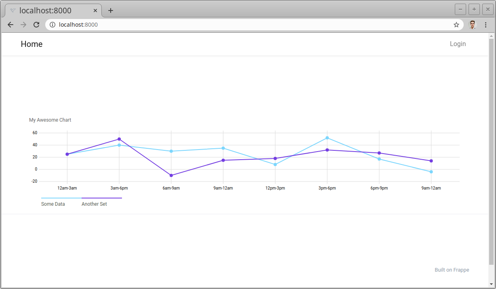

## Frappe Charts

Example app, how to include [Frappe Charts](https://frappe.io/charts) in a public frappe page.



Please check the following files:

- `frappe_charts/public/js/frappe_charts.js`
- `frappe_charts/public/build.json`
- `frappe_charts/www/index.html`
- `frappe_charts/www/index.js`
- `frappe_charts/hooks.py`

Frappe Charts was installed via NPM (you don't need to run this again for this app):

```
cd ~/frappe-bench/apps/frappe_charts
npm init
npm i -P frappe-charts
```

This way it got added to `package.json` and will be built automatically when the app gets installed.

Then, in `frappe_charts/public/js/frappe_charts.js` we import the code from the NPM package and store it in `frappe.Chart`:

```js
import { Chart } from 'frappe-charts/dist/frappe-charts.esm.js'

frappe.Chart = Chart;
```

In `frappe_charts/public/build.json` we define to build the above code into `assets/js/frappe_charts.min.js` (the `assets/` part is implicit). This step creates a new file `frappe_charts.min.js`

In `frappe_charts/hooks.py` we define to serve `assets/js/frappe_charts.min.js` with every public page:

```py
# include js, css files in header of web template
web_include_js = "/assets/js/frappe_charts.min.js"
```

Now we can use `frappe.Chart()` in any public page, like `frappe_charts/www/index.html`.

#### License

Copyright (c) 2020 ALYF GmbH

Permission is hereby granted, free of charge, to any person obtaining a copy of this software and associated documentation files (the "Software"), to deal in the Software without restriction, including without limitation the rights to use, copy, modify, merge, publish, distribute, sublicense, and/or sell copies of the Software, and to permit persons to whom the Software is furnished to do so, subject to the following conditions:

The above copyright notice and this permission notice shall be included in all copies or substantial portions of the Software.

THE SOFTWARE IS PROVIDED "AS IS", WITHOUT WARRANTY OF ANY KIND, EXPRESS OR IMPLIED, INCLUDING BUT NOT LIMITED TO THE WARRANTIES OF MERCHANTABILITY, FITNESS FOR A PARTICULAR PURPOSE AND NONINFRINGEMENT. IN NO EVENT SHALL THE AUTHORS OR COPYRIGHT HOLDERS BE LIABLE FOR ANY CLAIM, DAMAGES OR OTHER LIABILITY, WHETHER IN AN ACTION OF CONTRACT, TORT OR OTHERWISE, ARISING FROM, OUT OF OR IN CONNECTION WITH THE SOFTWARE OR THE USE OR OTHER DEALINGS IN THE SOFTWARE.
